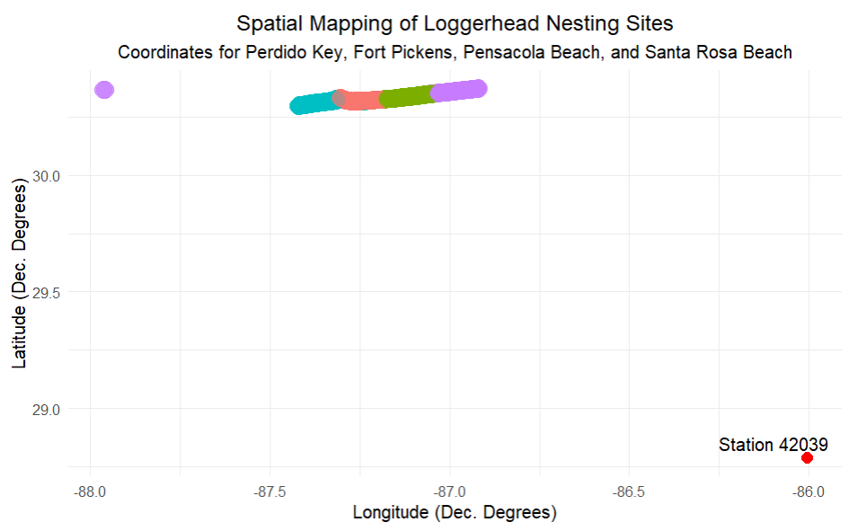

## Introduction{background-image="loggerhead.jpg" background-opacity="0.3"}

* **Time Series Analysis** to evaluate Loggerhead Turtle Nesting Habits
* **Biological Data** can be strongly Seasonal
* How **predictable** are the season start/end dates?
* How much **influence** do environmental factors have on outcomes?
* **Nesting Totals** (Main) and **Temperature** (Exogenous)
* Integration of all data to produce a **robust model**
* Helps support **local conservation** activities

## Turtle Biology and Beyond {background-image="loggerhead.jpg" background-opacity="0.3"}

* **Threatened Species**
* Reach sexual **maturity** at 35 years old
* Females return to their nesting site **every 2 (or more) years**
* Average of **4 nests** created each season
* A nest is created about **every 14 days**
* **Nesting season** is generally May through September
* Florida is host to about **100,000 nests each year**

## Delving Into The Data{background-image="oilSpill.png" background-opacity="0.2"}

::: {.rows}

::: {.row height="40%"}

* Gulf Coast Buoy Water Temperature Data added to original data set

:::

::: {.row height="60%"}

{fig-align="center" height="450px" width="950px"}
:::

:::

## Delving Into The Data{background-image="oilSpill.png" background-opacity="0.2"}

* **Date**, **Location**, Longitude, Latitude
* Leatherback, Green, Kemp's Riley and **Loggerhead Turtles**
* Perdido Key (most nests), Fort Pickens, Pensacola Beach, Santa Rosa Beach
* Not every day had a nest; not every day had a temperature
* Saved the **temperature** at, or next closest time to, 3pm daily
* Grouped nests per month (most in July)
* Data Range, 1998-2020 - 2017 highest number of nesting sites

## Environmental Disasters: 1998-2020{background-image="oilSpill.png" background-opacity="0.5"}

::: {.absolute bottom="60" left="220"}

* **Warmest Average Temperature, 1998; tied with 1934**
* **Hurricane Ivan, September, 2004: Category 3, Baldwin (AL), Escambia (FL), and Santa Rosa (FL) counties affected** 
* **Deep Horizon Oil Spill, 2010: 134 million gallons and is the largest spill in US history (noaa.gov)**

:::

## TSA SARIMAX Components{.smaller background-image="turtletracks.jpg" background-opacity="0.3"}

* The **S (Seasonal) Component** represents the **regular intervals** at which a relationship can be identified; it is to be expected using biological data, i.e., finding the natural rythmn of the model.

* The **AR (Autoregressive) Component, p**, involves the model using the relationship of the variable with its own **previous values** (or lagged observations).
    
* The **I (Integrated) Component, d**, helps to **stabilize the mean** and remove trends from the time series analysis; makes the model stationary by **differencing**.
    
* The **MA (Moving Average) Component, q**, represents the effect of **previous error** terms on the present value of the time series.
    
* The **X (eXogenous) Component** is an **external variable** that can help fill in the gaps of past behaviour of the data to soften fluctuations and strengthen future predictions. For this analysis, our exogenous variable is the Gulf of Mexico Surface Water Temperature.

## TSA Process {background-image="turtletracks.jpg" background-opacity="0.3"}

*  **Exploring** relationships in the data
*  Examining the **Stationarity** of data
*  Determining the **Decomposition** method
*  Selecting a **Model** to capture seasonality trend
*  **Training and validation** of the model
*  Assessing the resulting **Metrics**
*  **Forecasting** outcomes and testing consequential **Residuals**

## Exploratory Data Visualizations {.smaller background-image="turtletracks.jpg" background-opacity="0.3" background-size="cover"}

{fig-align="center"}

## Exploratory Data Visializations {.smaller background-image="turtletracks.jpg" background-opacity="0.3" background-size="cover"}

{fig-align="center"}

## Box-Jenkins: Identification{.smaller background-image="turtletracks.jpg" background-opacity="0.3" background-size="cover"}

::: {.columns}

::: {.column width="40%"}

* **Stationarity of Data**
* Augmented Dickey-Fuller Test (Unit Root Test)
* Use the KPSS value (Kwiatkowski-Phillips-Schmidt-Shin)
* KPSS p-value > 0.05
* **Nesting Activity, p = 0.09** 
* **Avg. Temperature, p = 0.10**
* AutoCorrelation Function (ACF) Plot behavior confirms ADF Test
* **RESULT: Non-Stationary**

:::

::: {.column width="60%"}

{fig-align="right" height="270px"}

{fig-align="right" height="270px"}

:::

:::

## Box-Jenkins: Identification {.smaller background-image="turtletracks.jpg" background-opacity="0.3" background-size="cover"}

::: {.columns}

::: {.column width="40%"}

* **Seasonality of Data**
* Observe the Lags
* Spikes inside "Insignificant Zone" ignored
* Use the last Spike
* Can be Monthly (1) to Annually (12) and anything in between
* **RESULT: Lag 12**

:::

::: {.column width="60%"}

{fig-align="right" height="270px"}

{fig-align="right" height="270px"}
:::

:::

## Box-Jenkins: Estimation{.smaller background-image="turtletracks.jpg" background-opacity="0.3"}

::: {.columns}

::: {.column width="45%"}

* **Nest STL Plot**
* Seasonal and Trend decomposition using Loess in feasts Package
* Residuals, or Remainder, (Y) not constant over time
* Residuals grow as number of nests increase
* **RESULT: MULTIPLICATIVE DECOMPOSITION**
* Trend not completely horizontal
* **RESULT: Differencing, D = 1**
* Trend Strength = 0.3163
* Seasonal Strength = 0.7951
* **RESULT: SEASONAL, S = 1**

:::

::: {.column width="55%"}

{fig-align="right" height="275px"}

{fig-align="right" height="275px"}

:::

:::

## Box-Jenkins: Estimation{.smaller background-image="turtletracks.jpg" background-opacity="0.3"}

::: {.columns}

::: {.column width="60%"}

* **Modelling**
* p, d, q, P, D, Q to be estimated/confirmed
* Annual model, monthly data used
* All coefficients were significant; greater than their doubled standard error, respectively
* fable package used for ARIMA() and model() functions
* Dip in 2019?
* Parsimonious model... for now!

:::

::: {.column width="40%"}

{fig-align="center"}

{fig-align="right"}

:::

$$\mathbf{
    (1-B^{12})y_t=(1+\theta_1 B+ \theta_2 B^2)(1+\Theta_1 B^{12})\epsilon_t
                 =(1+0.6B+ 0.14B^2)(1-0.7B^{12})\epsilon_t}
$$
:::

## Box-Jenkins: Diagnostic Checks{.smaller background-image="turtletracks.jpg" background-opacity="0.3"}
:::{rows}

:::{.row height="60%"}

* **Innovation Residuals** - shows minor "shock" fluctuations mostly remain around zero-mean ("White Noise")
* **Ljung-Box Test** (ACF Analysis) - the model can be viewed as a success given that the spikes at 12 and 24 are within the "insignificant" zone
* **Residual Histogram** (count vs residuals) - shows that the residuals are centered about zero and follows a fairly normal (bell-shaped) distribution suggesting that the model is unbiased. 
* **Conclusion** - all available patterns have been captured; the residuals have shown to be uncorrelated and normally distributed

:::

:::{.row height="40%"}

{fig-align="center" width="500" height="240"}

:::

:::

## 7. Training and Validation{.smaller background-image="turtletracks.jpg" background-opacity="0.3"}

## 7. Modeling and Results{.smaller background-image="turtletracks.jpg" background-opacity="0.2"}

::: {layout=[[1,1],[1,1]]}

:::

-   Explain your data preprocessing and cleaning steps.

-   Present your key findings in a clear and concise manner.

-   Use visuals to support your claims.

-   **Tell a story about what the data reveals.**

## 8. Conclusion{.smaller background-image="LoggerheadHatchlings.jpg" background-opacity="0.2"}

::: {layout=[[1,1],[1,1]]}

:::

-   Summarize your key findings.

-   Discuss the implications of your results.

## References{.smaller background-image="Yellowsign.jpg" background-opacity="0.3"}

coast.noaa.gov - hurricane reports
noaa.gov - 
ncei.noaa.gov - national climate report https://www.ncei.noaa.gov/access/monitoring/monthly-report/national/201013

## Callout Important

::: callout-important
**Turtle Tangent:** Your goal is to make your audience understand and care
about your findings. By crafting a compelling story, you can effectively
communicate the value of your data science project.

Carefully read this template since it has instructions and tips to
writing!

More information about `revealjs`:
<https://quarto.org/docs/reference/formats/presentations/revealjs.html>
:::
