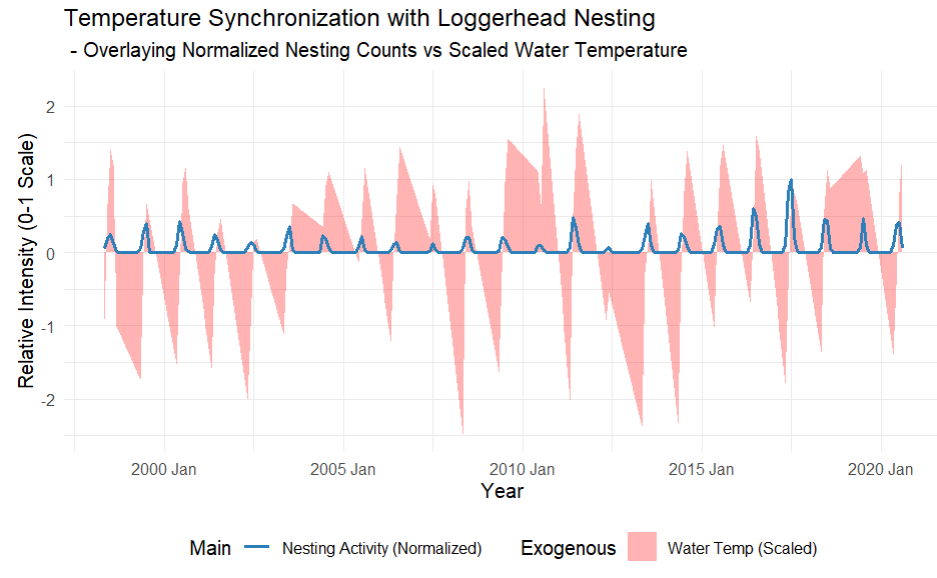
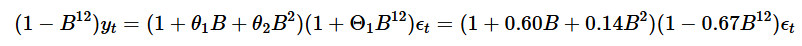
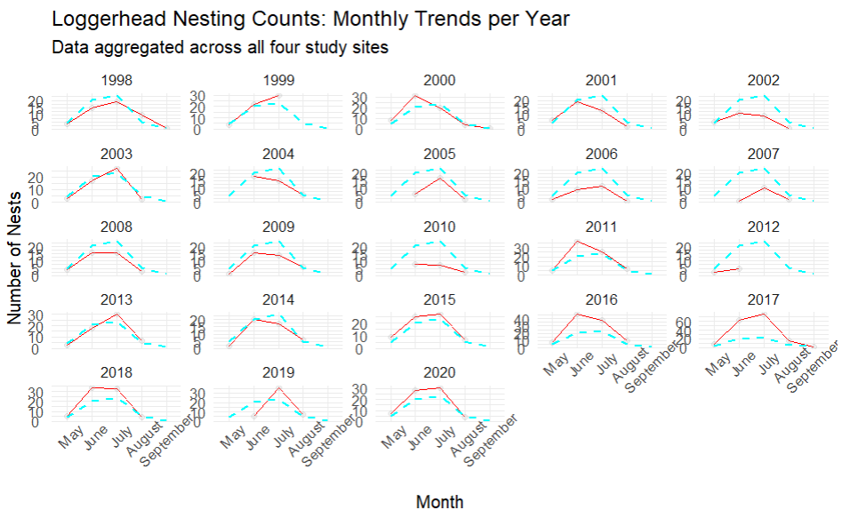
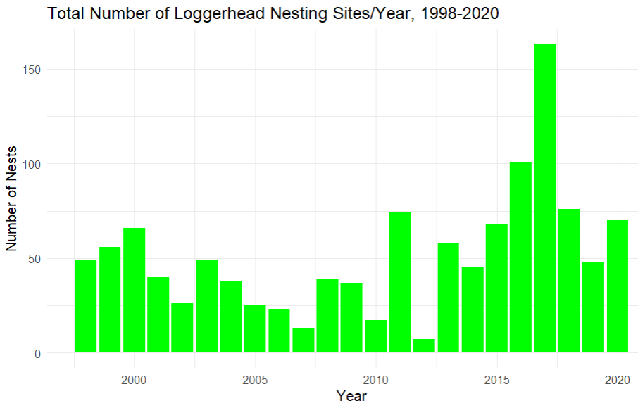

## Introduction{background-image="loggerhead.jpg" background-opacity="0.2"}

- **Time Series Analysis** to evaluate Loggerhead Turtle Nesting Habits
- **Biological Data** can be strongly Seasonal
    
- How **predictable** are the season start/end dates?
- How much **influence** do environmental factors have on outcomes?

- **Nesting Totals** (Main) and **Temperature** (Exogenous)
-   Integration of all data to produce a **robust model**

-   To help **local environmentalists** with conservation activities

## Background Information{background-image="turtletracks.jpg" background-opacity="0.2"}

- **Threatened Species**
- Reach sexual **maturity** at 35 years old
- Females return to their nesting site **every 2 (or more) years**
- Average of **4 nests** created each season
- A nest is created about **every 14 days**
- **Nesting season** is generally May through September
- Florida is host to about **100,000 nests each year**
- Our geographical **area of study** - Perdido Key (366), Fort Pickens (243), Pensacola Beach (278), Santa Rosa Beach (301)
  
## Synchronized Nest vs Temperature Plot{background-image="turtletracks.jpg" background-opacity="0.5" background-size="cover"}

::: {.absolute top="20%" left="8.5%" width="90%" height="70%" style="text-align: center; background-color: rgba(255, 255, 255, 0.4); padding: 10px; border-radius: 10px;"}

{width="80%" fig-align="center"}
:::

::: {.absolute bottom="5%" left="15%"}

:::

## Process {background-image="synchedNestvsTemp.png" background-size="contain" background-opacity="0.2"}

-   Exploring the data and possible relationships
-   Examining the stationarity of data
-   Determining the decomposition method
-   Selecting a model to capture seasonality trend
-   Training and validation of the model
-   Assessing the resulting metrics
-   Forecasting outcomes and testing consequential residuals

## 4. Delving Into The Data{.smaller background-image="turtletracks.jpg" background-opacity="0.2"}

-   Gulf Coast Buoy Water Temperature Data added depth to the study
-   Perdido Key, Fort Pickens, Pensacola Beach, Santa Rosa Beach
-   Leatherback, Green, Kemp's Riley and Loggerhead Turtles
-   Not every day had a nest; not every day had a temperature
-   Grouped nests per month; saved the temperature at 3pm (recorded 10 mins apart)

## 5. Next Slide{.smaller background-image="turtletracks.jpg" background-opacity="0.2"}

The **S (Seasonal) Component** represents the **regular intervals** at which a relationship can be identified and is to be expected using biological data, i.e., finding the natural rythmn of the model.

The **AR (Autoregressive) Component, p**, involves the model using the relationship of the variable with its own **previous values** (or lagged observations).
    
The **I (Integrated) Component, d**, helps to **stabilize the mean** and remove trends from the time series analysis and makes it stationary by differencing (d).
    
The **MA (Moving Average) Component, q**, represents the effect of **previous error** terms on the present value of the time series.
    
The **X (eXogenous) Component** is an **external variable** that can help fill in the gaps of past behaviour of the data to soften fluctuations and strengthen future predictions. For this analysis, our exogenous variable is the Gulf of Mexico Surface Water Temperature.
    
## Next Slide

::: {layout=[[1,1],[1,1]]}

:::

$$
F_m = max(0,1-[Var(R_t)/Var(m_t + R_t)])
$$

## 6. Next Slide{.smaller background-image="turtletracks.jpg" background-opacity="0.2"}

::: {layout=[[1,1],[1,1]]}

:::

## 7. Modeling and Results{.smaller background-image="turtletracks.jpg" background-opacity="0.2"}

::: {layout=[[1,1],[1,1]]}

:::

-   Explain your data preprocessing and cleaning steps.

-   Present your key findings in a clear and concise manner.

-   Use visuals to support your claims.

-   **Tell a story about what the data reveals.**

## 8. Conclusion{.smaller background-image="LoggerheadHatchlings.jpg" background-opacity="0.2"}

::: {layout=[[1,1],[1,1]]}

:::

-   Summarize your key findings.

-   Discuss the implications of your results.

## References{.smaller background-image="Yellowsign.jpg" background-opacity="0.3"}

- In kernel estimator, weight function is known as kernel function
[@efr2008]. Cite this paper [@bro2014principal]. The GEE [@wang2014].
The PCA [@daffertshofer2004pca]\*

## Callout Important

::: callout-important
**Turtle Tangent:** Your goal is to make your audience understand and care
about your findings. By crafting a compelling story, you can effectively
communicate the value of your data science project.

Carefully read this template since it has instructions and tips to
writing!

More information about `revealjs`:
<https://quarto.org/docs/reference/formats/presentations/revealjs.html>
:::
