```{r setup, include = FALSE}
knitr::opts_chunk$set(
	echo = FALSE,
	message = FALSE,
	warning = FALSE
)
library(readxl)
library(dplyr)
library(knitr)
library(kableExtra)
library(ggplot2)   
library(lubridate)
library(fpp3)
library(purrr)
library(feasts)
library(tsibble)
library(dplyr)
library(tidyverse)
library(urca)
library(itsmr)
library(slider)
library(broom)
library(fable.prophet)
library(gt)
library(patchwork)
```

```{r}
data <- read_excel("Nest Data 1998 - 2020_Final.xlsx")

data$Location <- toupper(data$Location)
data$Species <- toupper(data$Species)

data <- data %>%
  mutate(C_Date = dmy(paste(Date, Year, sep = "-"))) %>%
  mutate(Month = month(C_Date, label = TRUE, abbr = FALSE), Year = year(C_Date))

temp_data <- "PENSACOLA SOUTH WATER TEMP.xlsx"
nas_temp_data <- "PNS_NAS.xlsx"
ob_temp_data <- "ORANGE BEACH WATER TEMP.xlsx"

years <- excel_sheets(temp_data)

all_years <- lapply(years, function(x) read_excel(temp_data, sheet = x))

column_conversions <- map(years, ~{ #get rid of white space and make all column headers lower case
    read_excel(temp_data, sheet = .x) %>%
    rename_with(~tolower(trimws(.x))) %>%
    mutate(yyyy = as.numeric(yy), mm = as.numeric(mm),
           dd = as.numeric(dd), hh = as.numeric(hh),
           yyyy = ifelse(yyyy < 99, yyyy + 1900, yyyy),# sheet 1998 had its year written as 98
           C_Date = make_date(yyyy, mm, dd))})

wtmp_data <- map(column_conversions, ~{ .x %>%
                filter(wtmp < 90) %>%
                filter(hh == 15) %>% #filter out the 1st hour 15 of each day - the temp at 3pm daily
                group_by(C_Date) %>%
                slice(1) %>%
                ungroup()})

wtmp_select_data <- map(wtmp_data, ~{ .x %>% select(C_Date, wtmp)})

wtmp_all_sheets <- bind_rows(wtmp_select_data)

sth_tmp_all_sheets <- wtmp_all_sheets %>%
                      filter(month(C_Date) %in% 5:9) %>%
                      rename('South_Temp' = wtmp) %>%
                      drop_na()

nas_years <- excel_sheets(nas_temp_data)

all_nas_years <- lapply(nas_years, function(x) read_excel(nas_temp_data, sheet = x))

column_conversions <- map(nas_years, ~{ #get rid of white space and make all column headers lower case
    read_excel(nas_temp_data, sheet = .x) %>%
    rename_with(~tolower(trimws(.x))) %>%
    mutate(yyyy = as.numeric(yy), mm = as.numeric(mm),
           dd = as.numeric(dd), hh = as.numeric(hh),
           C_Date = make_date(yyyy, mm, dd))})

nas_tmp_data <- map(column_conversions, ~{ .x %>%
                filter(wtmp < 90) %>% #filter out erroneous temp readings
                filter(hh == 15) %>% #filter out the 1st hour 15 of each day - the temp at 3pm daily
                group_by(C_Date) %>%
                slice(1) %>%
                ungroup()})

nas_tmp_select_data <- map(nas_tmp_data, ~{ .x %>%
                                    select(C_Date, wtmp)})
nas_tmp_all_sheets <- bind_rows(nas_tmp_select_data)

nas_tmp_all_sheets <- nas_tmp_all_sheets %>%
                      filter(month(C_Date) %in% 5:9) %>%
                      rename('NAS_Temp' = wtmp) %>%
                      drop_na()

ob_years <- excel_sheets(ob_temp_data)

all_ob_years <- lapply(ob_years, function(x) read_excel(ob_temp_data, 
                                                        sheet = x))
column_conversions <- map(ob_years, ~{ #get rid of white space and make all column headers lower case
    read_excel(ob_temp_data, sheet = .x) %>%
    rename_with(~tolower(trimws(.x))) %>%
    mutate(yyyy = as.numeric(yy), mm = as.numeric(mm),
           dd = as.numeric(dd), hh = as.numeric(hh),
           C_Date = make_date(yyyy, mm, dd))})

ob_tmp_data <- map(column_conversions, ~{ .x %>%
                filter(wtmp < 90) %>% #filter out erroneous temp readings
                filter(hh == 15) %>% #filter out the 1st hour 1500 of each day - the temp at 3pm daily
                group_by(C_Date) %>%
                slice(1) %>%
                ungroup()})

ob_tmp_select_data <- map(ob_tmp_data, ~{ .x %>% select(C_Date, wtmp)})

ob_tmp_all_sheets <- bind_rows(ob_tmp_select_data)

ob_tmp_all_sheets <- ob_tmp_all_sheets %>%
                      filter(month(C_Date) %in% 5:9) %>%
                      rename('OB_Temp' = wtmp) %>%
                      drop_na()

all_temp_data <- sth_tmp_all_sheets %>%
  left_join(ob_tmp_all_sheets, by = "C_Date", suffix = c("_STH", "_OB")) %>%
  left_join(nas_tmp_all_sheets, by = "C_Date") %>%
  drop_na()

pivot_temp <- all_temp_data %>%
  pivot_longer(cols = c(South_Temp, OB_Temp, NAS_Temp), 
               names_to = "Buoys", 
               values_to = "Temp_Reading") %>%
  drop_na(Temp_Reading)

all_data <- data %>%
  left_join(wtmp_all_sheets, by = "C_Date")

all_data <- all_data %>%
  rename('Water Temp.' = wtmp) %>%
  drop_na()

all_data <- all_data %>% 
  arrange(desc('Water Temp')) %>%
  filter(Species == "CC")
  
kable_table_CConly <- all_data %>%
  select(C_Date, Location, 'Water Temp.', Latitude, Longitude) %>%
  head(5) %>%
  gt() %>%
  tab_header(title = "Initial Data Including Water Temperature",
             subtitle = "Partial Table") %>%
  cols_label(C_Date = "Date", Location = "Location", `Water Temp.` = "Water Temp (degC)", 
             Latitude = "Latitude (DDeg)", Longitude = "Longitude (DDeg)") %>%
  cols_align("center", columns = c(Location, `Water Temp.`, Latitude, Longitude))

map_points <- all_data %>%
  group_by(Location) %>%
  ungroup()

# spatial plot
spatial_plot <- ggplot(map_points, aes(x = Longitude, y = Latitude, color = Location)) +
  geom_point(size = 5, alpha = 0.7) +
  theme_minimal() +
  labs(title = "Spatial Mapping of Coordinates of Loggerhead Nesting Sites",
       subtitle = " Perdido Key - PK, Fort Pickens - FP, Pensacola Beach - PB, and Santa Rosa Beach - SR",
       x = "Longitude (Dec. Degrees)", y = "Latitude (Dec. Degrees)", color = "Nesting Site") +
  annotate("point", x = -86.007, y = 28.787, color = "red", size = 3) +
  annotate("text", x = -86.007, y = 28.787, label = "Station 42039", vjust = -0.5, hjust = 0.8) +
  theme(plot.title = element_text(hjust = 0.5),
        plot.subtitle = element_text(hjust = 0.5),
        legend.position = "right") + # Hidden because points are labeled directly
  theme(panel.background = element_rect(fill = "gray95", color = "black"))

table_beaches <- all_data %>%
  mutate(Location = case_match(Location,
                               "PK" ~ "Perdido Key",
                               "FP" ~ "Fort Pickens",
                               "PB" ~ "Pensacola Beach",
                               "SR" ~ "Santa Rosa Beach")) %>%
  count(Location, name = "Number of Nests") %>% #descending order
  arrange(desc(`Number of Nests`))

kable_table_beaches <- table_beaches%>% 
  gt() %>%
  gt::tab_header(title = "Beach Area Nest Totals") %>%
  gt::cols_label(Location = "Location", `Number of Nests` = "Nest Total")

#graph to show yearly counts of nesting sites
annually_cnts <- all_data %>%
  group_by(Year) %>% 
  summarise(Ttl_Nests = n())

yrly_cnt_nest_sites <- ggplot(annually_cnts, aes(x = Year, y = Ttl_Nests)) +
  geom_bar(stat = "identity", fill = "green") +
  labs(title = "Total Number of Loggerhead Nesting Sites/Year, 1998-2020",
       x = "Year", y = "Number of Nests") +
  theme_minimal()

monthly_cnts <- all_data %>%
  group_by(Month) %>% 
  summarise(Ttl_Nests = n())

mnthly_cnt_nest_sites <- ggplot(monthly_cnts, aes(x = Month, y = Ttl_Nests)) +
  geom_bar(stat = "identity", fill = "darkgreen") +
  labs(title = "Total Number of Loggerhead Nesting Sites/Month, 1998-2020",
       x = "Month", y = "Number of Nests") +
  theme_minimal()

trends <- all_data %>%
  mutate(Month = month(C_Date, label = TRUE, abbr = FALSE),
         YearFactored = as.factor(year(C_Date))) %>%
  group_by(YearFactored, Month) %>%
  summarise(NestsPerMonth = n(), .groups = "drop")

trend_avg <- trends %>%
  group_by(Month) %>%
  summarise(Nests_avg = mean(NestsPerMonth), .groups = "drop")

overlay_plot <- ggplot() +
  geom_line(data = trends, 
            aes(x = Month, y = NestsPerMonth, group = YearFactored, color = YearFactored),
                linewidth = 0.95, alpha = 0.5,
                na.rm = TRUE) +
  geom_line(data = trend_avg, 
            aes(x = Month, y = Nests_avg, group = 1),
                color = "black", alpha = 1,
                na.rm = TRUE) +
  geom_point(data = trend_avg, 
             aes(x= Month, y = Nests_avg), 
             color = "black", size = 1,
             na.rm = TRUE) +
  labs(title = "Total Number of Loggerhead Nesting Sites/Month, 1998-2020",
       subtitle = "Each year graphed separately to show peak nesting times",
       x = "Month", y = "Number of Nests",
       color = "Year") +
  theme_minimal()

all_data <- all_data %>% 
  filter(Month != "November") %>% 
  filter(Month != "October") %>% # Removes October and November per Dr Schmutz
  mutate(Month = factor(Month, levels = c("May", "June", "July", "August", "September"))) # Month is a factored so the x-axis is in month order

monthly_cnts_ind <- all_data %>%
  # Extract Year and Month from your date object
  mutate(Year = year(C_Date), 
         Month = month(C_Date, label = TRUE, abbr = FALSE)) %>%
  group_by(Year, Month) %>%
  summarise(Ttl_Nests = n())

#separate graphs for each year
ind_plots <- ggplot(monthly_cnts_ind, aes(x = Month, y = Ttl_Nests, group = Year)) +
  geom_line(color = "red", linewidth = 0.5, alpha = 1) +
  geom_point(color = "grey", alpha = 0.25) +
  # overlay average
  geom_line(data = trend_avg, aes(x = Month, y = Nests_avg, group = 1), 
            color = "#2c7fb8", linetype = "dashed", linewidth = 0.75) +
  # a separate small graph for each year
  facet_wrap(~ Year, scales = "free_y", ncol = 5) + 
  labs(title = "Loggerhead Nesting Counts: Monthly Trends per Year",
       subtitle = "Data aggregated across all four study sites",
       x = "Month",
       y = "Number of Nests") +
  scale_x_discrete(limits = c("May", "June", "July", "August", "September")) +
  theme_minimal() +
  theme(axis.text.x = element_text(angle = 45, hjust = 0.6), axis.text.y = element_text(hjust = 0.5)) +
  theme(panel.background = element_rect(fill = "gray95", color = "black"))

turtle_per_day <- all_data %>%
  group_by(C_Date) %>%
  summarise(total_per_day = n(), julian_index = min(yday(C_Date))) %>%
  as_tsibble(index = C_Date) %>%
  fill_gaps(total_per_day = 0L) %>%
  mutate(julian_index = yday(C_Date))

turtle_per_month <- all_data %>%
  mutate(month_index = yearmonth(C_Date)) %>%
  group_by(month_index) %>%
  summarise(total_per_month = n()) %>%
  as_tsibble(index = month_index) %>%
  fill_gaps(total_per_month = 0L)

season_listing <- turtle_per_day %>%
  index_by(Year = year(C_Date)) %>%
  summarise(
    season_start = min(C_Date[total_per_day > 0]),
    season_end   = max(C_Date[total_per_day > 0]),
    total_yearly = sum(total_per_day))

kable_table_season_dates <- season_listing %>%
  gt() %>%
  tab_header(title = "Annual Loggerhead Nesting Season Dates",
             subtitle = "- 1998-2020, Gulf Coast Study Area") %>%
  cols_label(Year = "Year", season_start = "Start Date",
             season_end = "End Date", total_yearly = "Total Sites") %>%
  cols_align(align = "center", columns = everything())

SARIMAX_table <- all_data %>%
  # filter for loggerhead species only
  filter(Species == "CC") %>%
  # filter out 999 temps
  filter(`Water Temp.` != 999) %>%
  # create a monthly index
  mutate(Month_Index = month(C_Date),
         Year_Month = yearmonth(C_Date)) %>%
  # aggregate nests & average the temp
  group_by(Year_Month) %>%
  summarise(total_per_month = n(),
            avg_water_temp = mean(`Water Temp.`, na.rm = TRUE)) %>%
  as_tsibble(index = Year_Month) %>%
  fill_gaps(total_per_month = 0) %>%
  mutate(avg_water_temp = zoo::na.approx(avg_water_temp, na.rm = FALSE)) %>%
  tidyr::fill(avg_water_temp, .direction = "downup") %>%
  filter_index("1998 Jan" ~ "2020 Dec") %>%
  mutate(temp_scaled = (avg_water_temp - mean(avg_water_temp, 
                        na.rm = TRUE)) / sd(avg_water_temp, na.rm = TRUE))

synched_plot <- SARIMAX_table %>%
  # normalized total_per_month to a 0-1 scale to overlay
  mutate(nesting_norm = total_per_month / max(total_per_month, na.rm = TRUE)) %>%
  ggplot(aes(x = !!index(SARIMAX_table))) +
  # Temperature - filled area
  geom_area(aes(y = temp_scaled, fill = "Water Temp (Scaled)"), alpha = 0.3) +
  # Nesting Counts - solid line
  geom_line(aes(y = nesting_norm, color = "Nesting Activity (Normalized)"), size = 1) +
  # Styling
  scale_fill_manual(values = c("Water Temp (Scaled)" = "coral2")) +
  scale_color_manual(values = c("Nesting Activity (Normalized)" = "#2c7fb8")) +
  labs(title = "Temperature Synchronization with Loggerhead Nesting",
    subtitle = " - Overlaying Normalized Nesting Counts vs Scaled Water Temperature",
    x = "Year", y = "Relative Intensity (0-1 Scale)",
    fill = "Exogenous", color = "Main") +
  theme_minimal() +
  theme(legend.position = "bottom") +
  theme(panel.background = element_rect(fill = "gray95", color = "black"))

annually_cnts <- all_data %>%
  group_by(Year) %>% 
  summarise(Ttl_Nests = n())

yrly_cnt_nest_sites <- ggplot(annually_cnts, aes(x = Year, y = Ttl_Nests)) +
  geom_bar(stat = "identity", fill = "coral2") +
  labs(title = "Total Number of Loggerhead Nesting Sites/Year, 1998-2020",
       x = "Year", y = "Number of Nests") +
  theme_minimal() +
  theme(panel.background = element_rect(fill = "gray95", color = "black"))
```

## Introduction {background-color="#528B8B"}

* Evaluate Loggerhead Turtle Nesting Habits
* How **predictable** are the nesting counts?
* How much **influence** do environmental factors have on outcomes?
* Why **Time Series Analysis** as our chosen solution?
* Helps support **local conservation** activities

## Delving Into The Data {background-color="#528B8B"}

* Data Range, **1998-2020** - 2017 highest number of nesting sites
* **Date**, **Loggerhead Turtles**, **Temperature**
* **Grouped nests** per season month (most in July)
* **Not every day had a nest; not every day had a temperature**


## Delving Into The Data {background-color="#528B8B"}

::: {.rows}

::: {.row height="50%"}

Gulf Coast Buoy Water Temperature Data added

:::

::: {.row height="50%"}

```{r}
spatial_plot
```

:::

:::


## Natural Behavior {background-color="#528B8B"}

* Turtles are **ectothermic**
* **Nesting season** is generally May through September
* **Re-migration** interval **every 2 (or more) years**
* **Inter-nesting** interval (attempted) on average **every 14 days**
* Florida is the breeding ground for **90% of Loggerhead population** worldwide! 

## Environmental Disasters: 1998-2020 {background="oilSpill.png" background-opacity="0.9"}

::: {.absolute bottom="60" left="220"}

* **Hurricane Ivan, September, 2004: Category 3, Baldwin (AL), Escambia (FL), and Santa Rosa (FL) counties affected** 
* **Deep Horizon Oil Spill, 2010: 134 million gallons and is the largest spill in US history (noaa.gov)**

:::

## Impacts: 1998-2020 {background-color="#528B8B"}
```{r}
yrly_cnt_nest_sites
```

## TSA Process Overview {background-color="#528B8B"}

* **Exploring** relationships in the data

* Examining the **Stationarity** of data

* Determining the **Decomposition** method

* Selecting a **Model** to capture pattern(s)

* **Training and validation** of the model

* Assessing the resulting **Metrics**

* **Forecasting** outcomes and testing consequential **Residuals**


## Exploratory Data Visializations {background-color="#528B8B"}

```{r}
ind_plots
```

## Exploratory Data Visualizations {background-color="#528B8B"}

```{r}
synched_plot
```

## TSA SARIMAX Components {.smaller background-color="#528B8B"}

**S (Seasonal) Component** - represents the **regular intervals** at which a relationship can be identified; it is to be expected using biological data, i.e., finding the natural rhythm of the model.

**AR (Autoregressive) Component, p or P** - involves the model using the relationship of the variable with its own **previous values** (or lagged observations).
    
**I (Integrated) Component, d or D** - helps to **stabilize the mean** and remove trends from the time series analysis; makes the model stationary by **differencing**.
    
**MA (Moving Average) Component, q or Q** - represents the effect of **previous error** terms on the present value of the time series.
    
**X (eXogenous) Component** - the **external variable** that can help fill in the gaps of past behaviour of the data to soften fluctuations and strengthen future predictions. For this analysis, our exogenous variable is the Gulf of Mexico Surface Water Temperature.

**Note:** p, d, q are for trends within one season - P, D, Q are for trends from one season to the next

## Box-Jenkins: Identification{.smaller background-color="#528B8B"}

::: {.columns}

::: {.column width="40%"}

* **Stationarity of Data**
* Augmented Dickey-Fuller Test (Unit Root Test)
* Use the KPSS value (Kwiatkowski-Phillips-Schmidt-Shin)
* KPSS p-value > 0.05
* **Nesting Activity, p = 0.09** 
* **Avg. Temperature, p = 0.10**
* AutoCorrelation Function (ACF) Plot behavior confirms ADF Test
* **RESULT: Non-Stationary**

:::

::: {.column width="60%"}

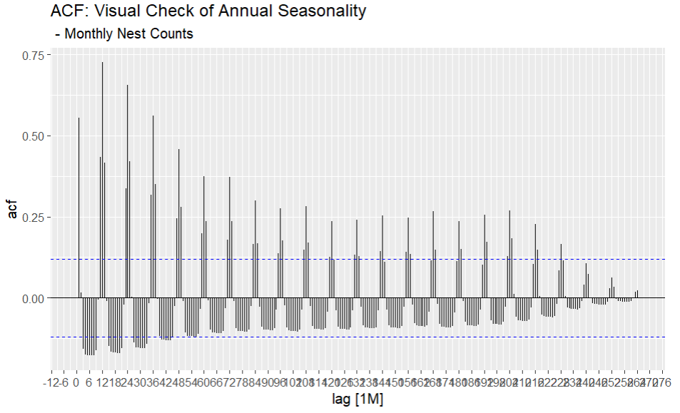{fig-align="right" height="270px"}

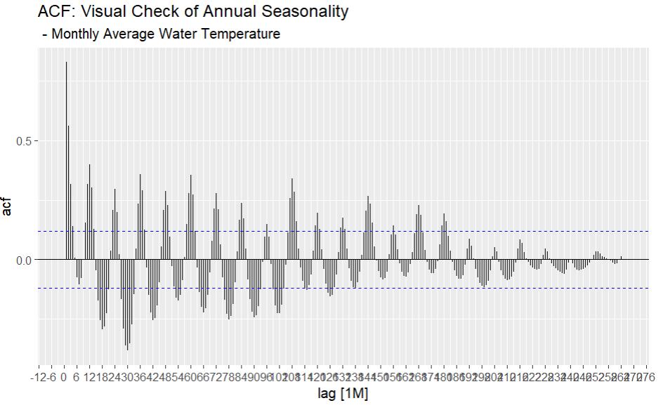{fig-align="right" height="270px"}

:::

:::

## Box-Jenkins: Identification {.smaller background-color="#528B8B"}

::: {.columns}

::: {.column width="50%"}

* **Seasonality of Data**
* Observe the Lags
* Spikes inside "Insignificant Zone" ignored
* Use the last Spike
* Can be Monthly (1) to Annually (12)
* **RESULT: Lag 12**

:::

::: {.column width="50%"}

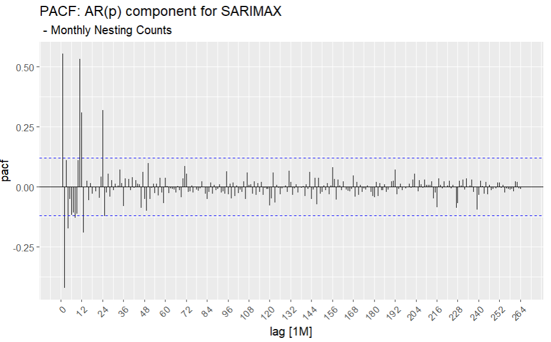{fig-align="left" width="400px" height="270px"}

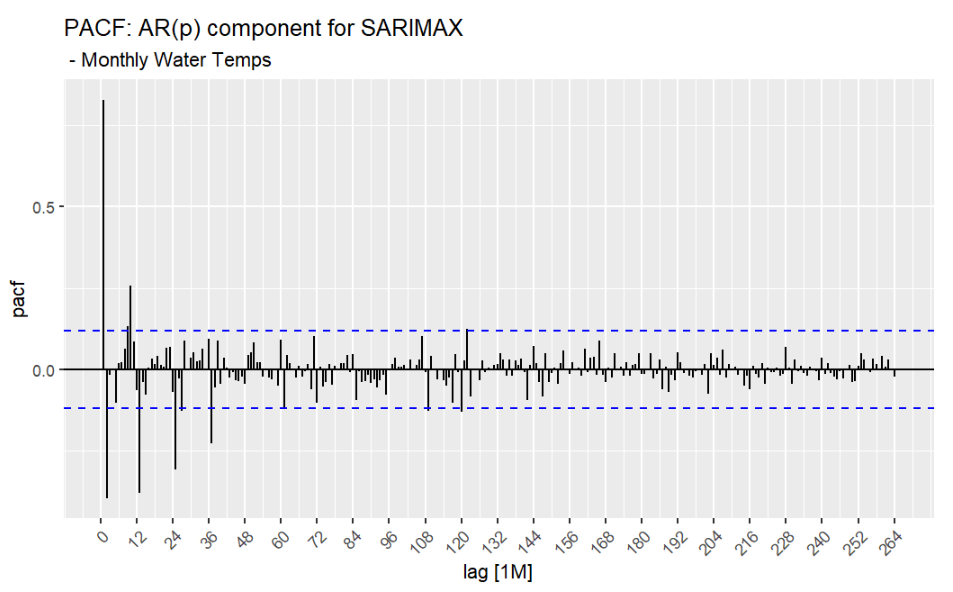{fig-align="left" width="400px" height="270px"}
:::

:::

## Box-Jenkins: Estimation{.smaller background-color="#528B8B"}

::: {.columns}

::: {.column width="50%"}

* **Nest STL Plot**
* Seasonal and Trend decomposition using Loess (feasts in R)
* Residuals, or Remainder, (Y) not constant over time
* Residuals grow as number of nests increase
* **RESULT: MULTIPLICATIVE DECOMPOSITION**
* Trend not completely horizontal
* **RESULT: Differencing, D = 1**
* Nesting Trend Strength = 0.3163
* Nesting Seasonal Strength = 0.7951
* **RESULT: VERY SEASONAL**

:::

::: {.column width="50%"}

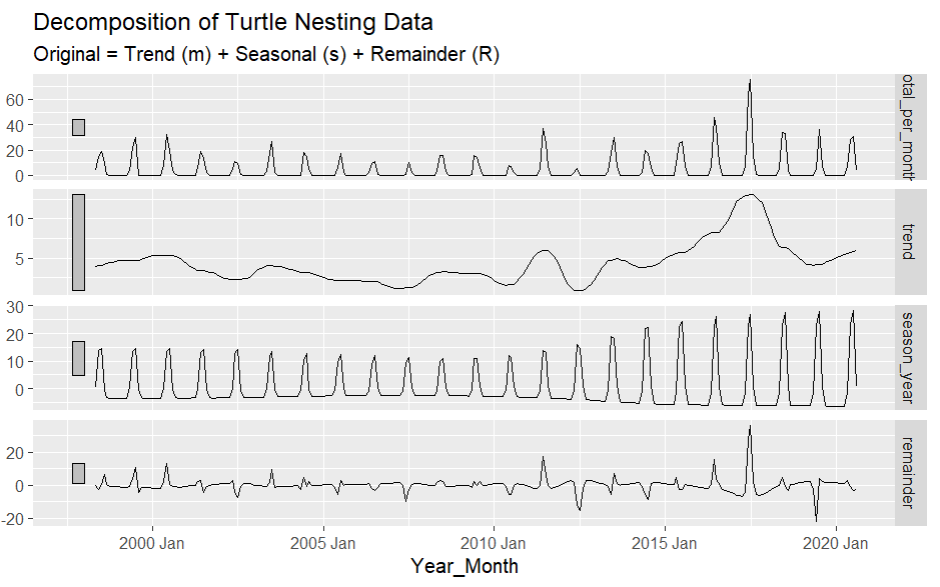{fig-align="right" height="275px"}

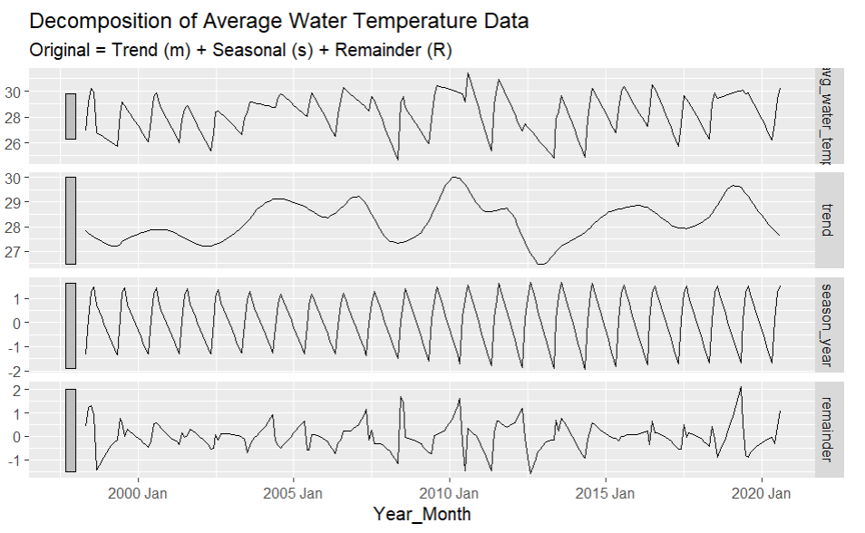{fig-align="right" height="275px"}

:::

:::

## Box-Jenkins: Estimation{.smaller background-color="#528B8B"}

::: {.columns}

::: {.column width="60%"}

* **Modelling**
* p, d, q, P, D, Q to be estimated/confirmed
* Annual model, monthly data used
* Use z-statistic ~ p-value
* fable package used for ARIMA() and model() functions
* D = 1 added to stabilize the mean
* New model... **ARIMA(0,0,2)(0,1,1)[12]**
* Will be tested as a "neighbor" model in Validation
:::

::: {.column width="40%"}

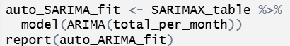{fig-align="center"}

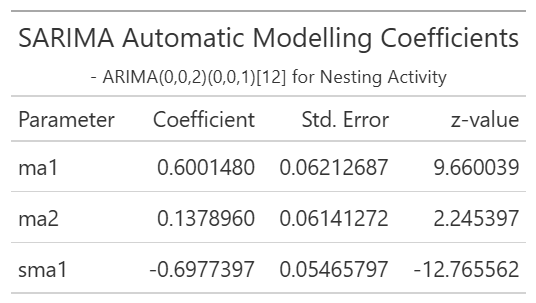{fig-align="right"}

:::

$$\mathbf{
    (1-B^{12})y_t=(1+\theta_1 B+ \theta_2 B^2)(1+\Theta_1 B^{12})\epsilon_t}
$$

$$\mathbf{
=(1+0.6B+ 0.14B^2)(1-0.7B^{12})\epsilon_t}
$$
:::

## Box-Jenkins: Diagnostic Checks{.smaller background-color="#528B8B"}

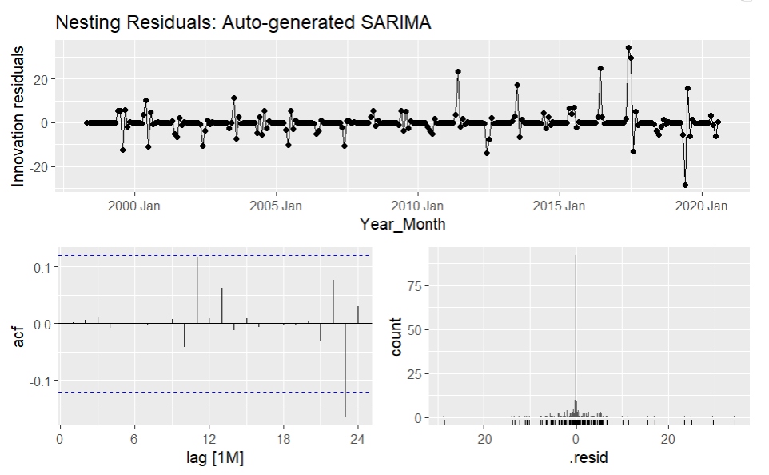{fig-align="center"}


## Training and Validation{.smaller background-color="#528B8B"}

:::::{columns}

:::{.column width="50%}

* Models trained on data from 1998-2018

* n_sarimax_002_011 = ARIMA(total_per_month ~ pdq(0,0,2) + PDQ(0,1,1))

* temp_sarimax_002_011 = ARIMA(total_per_month ~ avg_water_temp + pdq(0,0,2) + PDQ(0,1,1))

* sarimax_002_001 = ARIMA(total_per_month ~ pdq(0,0,2) + PDQ(0,0,1))

* fourier_sarimax_5 = ARIMA(total_per_month ~ fourier(K = 5) + pdq(0,0,2))

:::

:::{.column width="50%"}

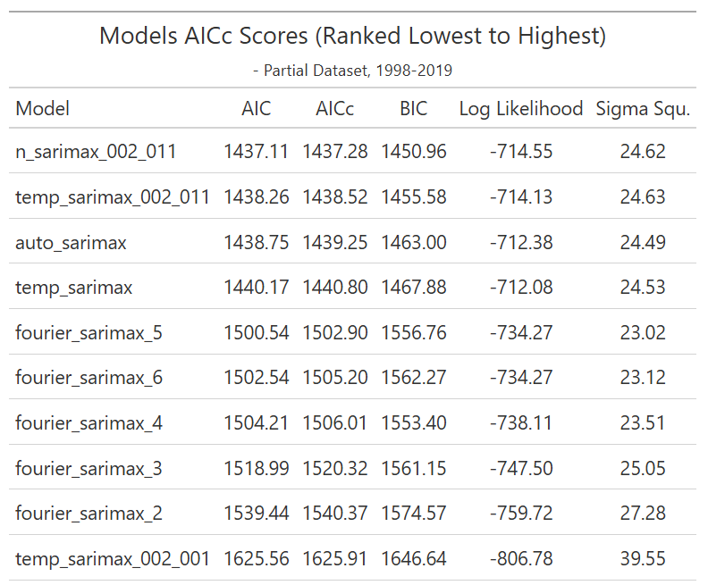{align="right" height="300px"}

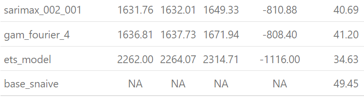{align="right" height="100px"}

:::

:::::

## Forecasting and Metrics {.smaller background-color="#528B8B"}

:::::{columns}

:::{.column width="49%"}

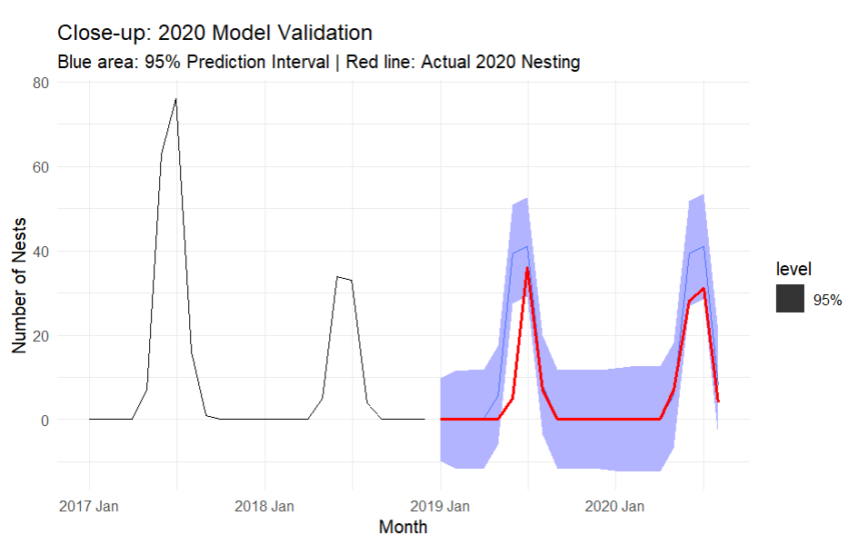{align="center" width="300" height="250px"}

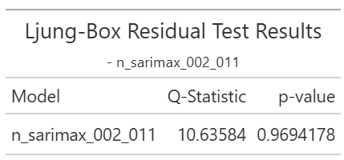{align="center" height="120px"}
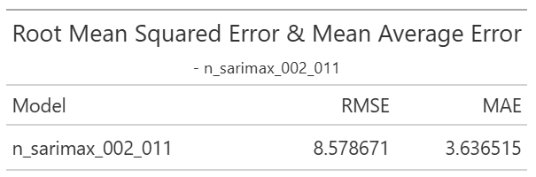{align="center" height="120px"}
:::

:::{.column width="51%"}

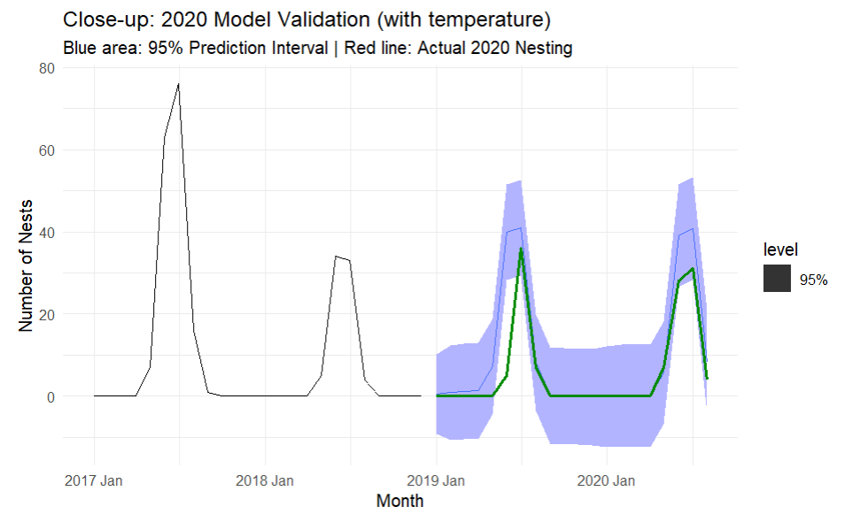{align="center" width="300" height="250px"}

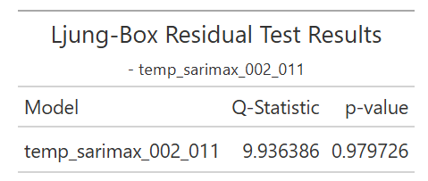{align="center" height="120px"}
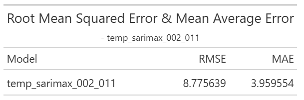{align="center" height="120px"}
:::

:::::


## Conclusion {background-color="#528B8B"}

* $\pm{(4-9)}$ nests per month using water temperature to guide through the nesting patterns while also handling extraneous negative influences (natural and man-made).

* The model showed excellent forecasting where it can attain 95% confidence level and so can be considered a practical surveillance tool.

* Turtles still have individualistic circumstances but as a whole, they form a predictable population that can be monitored statistically without too much interference. 

## Future Work {background-color="#528B8B"}

* Looking at the beginning and end dates
* Observing how the peak of the nesting season changes over time.
* Individual areas to concentrate conservation activities

## References{.smaller background-color="#528B8B"}

coast.noaa.gov - Hurricane Reports

noaa.gov - National Oceanic and Atmospheric Administration

ncei.noaa.gov - National Climate Report 

myfwc.com

Troeger, D. (2022). goodnewsnetwork.org

## {background-color="#528B8B"}

::: {style="font-size: 2.5em; font-weight: bold; text-align: centered"}
## Questions?
:::

